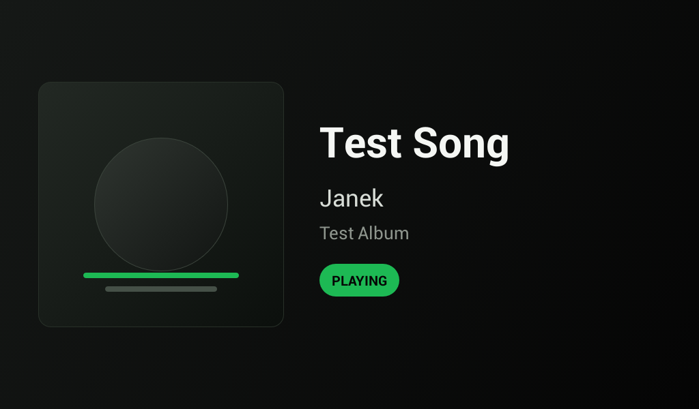
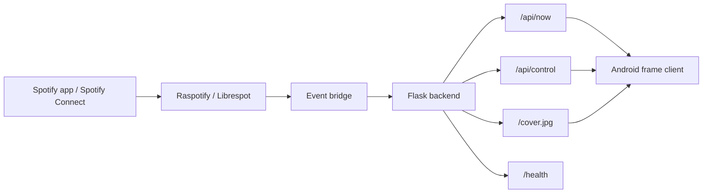

# Spotify Frame

> Turning a forgotten Android 4.2.2 photo frame into a dedicated Spotify now-playing display.



`Android 4.2.2` `minSdk 17` `Java only` `Raspberry Pi backend` `Spotify Connect`

## Overview

Spotify Frame is a thin Android client plus a small LAN backend.

The idea is simple:

- keep the old frame dumb and stable
- keep Spotify auth off the Android device
- render clean, readable now-playing UI from across the room
- let a Mac or Raspberry Pi handle the real logic

This project started on an old 1024x600 Wi-Fi photo frame with ADB access, a weird OEM launcher, and just enough hardware left to be useful.

## Why It Is Interesting

Most now-playing projects take the easy route:

- modern tablet
- web app
- full Spotify client on-device

This one does the opposite:

- Android 4.2.2
- no AndroidX
- no Kotlin
- no WebView
- one Java `Activity`
- local HTTP only

That constraint is the whole point. It turns a nearly useless device into a focused, always-on display.

## What It Does

- fetches now-playing data from a local backend every few seconds
- shows title, artist, album, state, progress, and cover art
- runs fullscreen in a kiosk-style layout
- keeps the screen awake
- works with `raspotify/librespot` on a Raspberry Pi
- supports touch controls when Spotify account permissions allow it

## Architecture



## Hardware Context

Current target setup:

- old Android photo frame
- Android `4.2.2`
- screen `1024x600`
- `adb` access
- Raspberry Pi backend on the same LAN

The Android app is intentionally a render-only client. Spotify credentials, token refresh, cover caching, and playback state live on the backend.

## Project Structure

```text
app/       Android client
backend/   Flask backend, Spotipy integration, librespot event bridge
gradle/    Gradle wrapper files
docs/      README assets
```

## Quick Start

### 1. Run the backend

```sh
python3 -m venv work/.venv-backend
source work/.venv-backend/bin/activate
pip install -r backend/requirements.txt
cp backend/.env.example backend/.env
python backend/authorize.py
python backend/run.py
```

For Raspberry Pi + `raspotify`, see [backend/README.md](backend/README.md).

### 2. Build the APK

```sh
./gradlew -PspotifyFrameBackendUrl=http://192.168.1.50:8000 assembleDebug
```

### 3. Install and launch

```sh
adb install -r app/build/outputs/apk/debug/app-debug.apk
adb shell am start -n com.janek.spotifyframe/.MainActivity
```

## Stack

- Android SDK 17
- Java
- Flask
- Spotipy
- `raspotify` / `librespot`
- `HttpURLConnection`
- `org.json.JSONObject`

## Current Status

Already working:

- Android 4.2.2-compatible display client
- local backend with Spotify auth
- album art caching
- fullscreen now-playing UI
- progress rendering
- touch playback controls
- Raspberry Pi deployment

Still worth improving:

- stronger resilience when router IPs change
- cleaner first-time setup flow
- smarter fallback behavior for missing playback state
- optional voice control / wake-word mode
- better real-world photos of the hardware

## Design Constraints

The app deliberately stays minimal:

- no Spotify secrets on Android
- no `/system` modification required for the normal APK flow
- no heavy UI framework
- no modern compatibility stack unless truly needed

That keeps the frame lightweight and makes the system easier to reason about when something on the network changes.

## Notes

- This repo does not include live Spotify tokens, local `.env` files, APK outputs, or extracted OEM system backups.
- Cover art and playback data are served over LAN, so the backend host matters.
- If playback is controlled from a different Spotify account than the one authorized for control, display can still work while touch controls may be limited.

## Backend Details

API contract, Raspberry Pi setup, and backend-specific notes live in [backend/README.md](backend/README.md).
